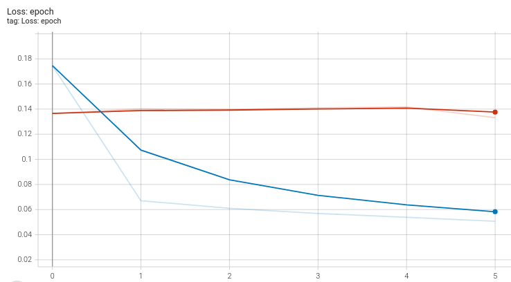
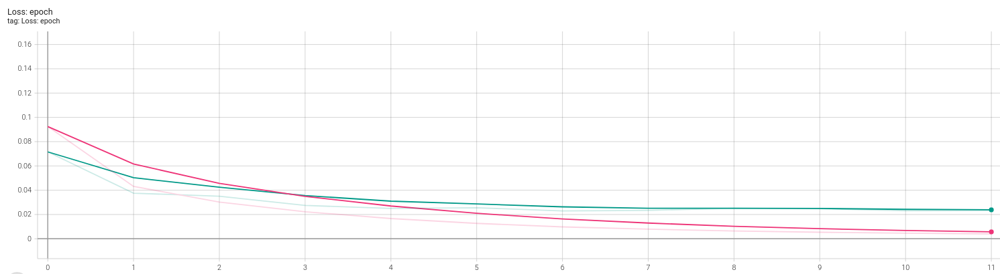

# Grammatical Spelling Correction
Grammatical Spelling Correction task was implemented with using T5 Small pre-trained model on Jfleg dataset. 

Model was trained with two different optimizers: Adam and AdaFactor. 

With using Adam optimizer validation loss wasn't being changed.

In terms of train/validation losses AdaFactor optimizer helps to perform training process more accurate.

